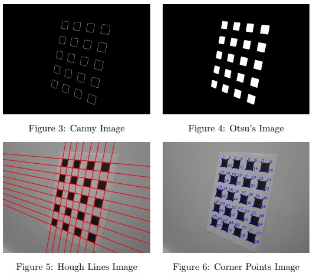

# 📸 Camera Calibration Using Zhang's Algorithm  

This repository contains **Homework 8** from the **Purdue ECE 661 - Computer Vision** course taught by **Professor Avinash Kak**. More information about the course can be found on his website: [Avinash Kak's Computer Vision Page](https://engineering.purdue.edu/kak/computervision/).  

## 📋 Project Overview  
This repository includes an implementation of **Zhang's Algorithm for Camera Calibration**, which determines intrinsic and extrinsic parameters of a camera from point correspondences.  

In this calibration process, we:  
- Extracted corner points of a checkerboard calibration pattern using an image processing pipeline with **Canny Edge Detection**, **Otsu Thresholding**, and **Hough Line Detection**.  
- Estimated the **camera intrinsic matrix** and **distortion coefficients** using a set of linear equations derived from the homography between the world and image planes.  
- Refined the parameters using **Nonlinear Optimization** to improve accuracy.  
- Enabled accurate mapping between 3D points and 2D projections, essential for applications like 3D reconstruction and AR.

## 🛠️ Setup  
1. Capture several images of a checkerboard pattern under different orientations and store them in the repository called **/Dataset1** which will be in same repository as the hw8.py file.  
3. Run the python file to compute intrinsic, extrinsic parameters, and create 3D reconstrcution.

## 🚀 Tech Stack  
- **Programming Language**: Python  
- **Libraries**: OpenCV, NumPy, SciPy, Matplotlib  

## 📷 Images  
Below are examples of the results produced by this project:  

### Corner Point Extraction  
  

### Camera Pose 3D Reconstruction  
  
